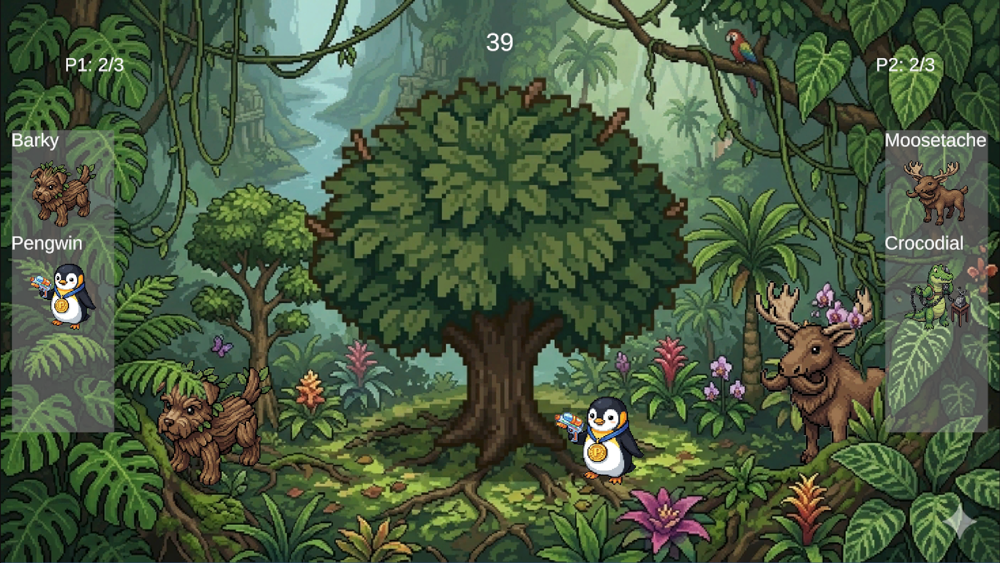
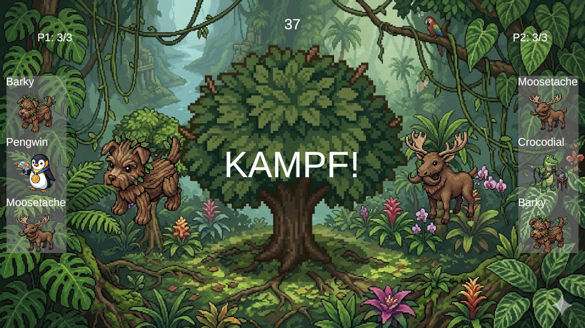
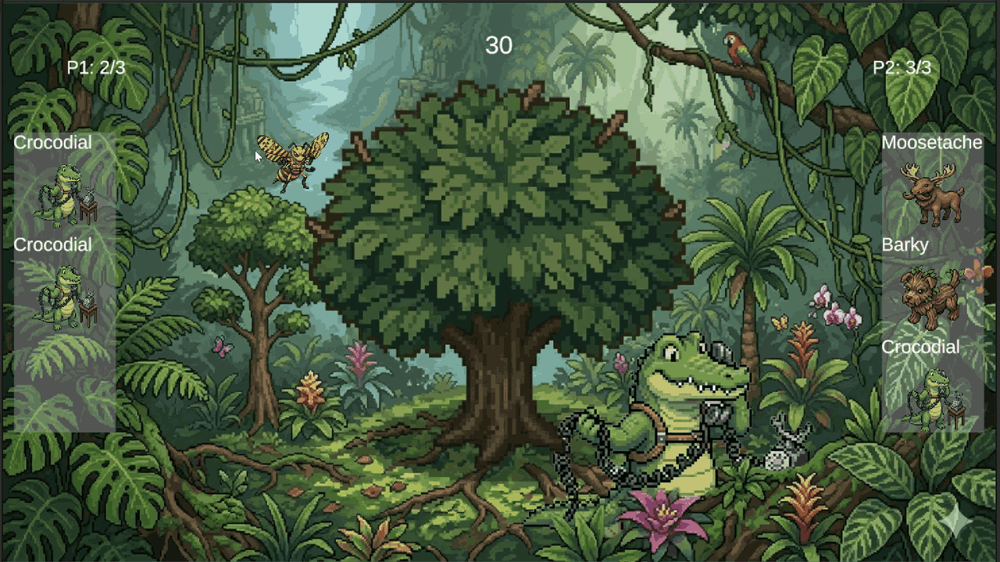

# CatchEmWall
CatchEmWall is an experimental 2D game project that combines a fast-paced, physics-based capture and combat system with charming creatures, modular systems, and a clear focus on expandability.  This repository currently contains concepts, documentation, and visual insights into the project.
The full Unity project will be published once the combat system reaches a stable state.

---

## Current Features
### Catching Phase
- Creatures roam dynamically through a jungle environment
- Player can catch creatures by throwing a ball
- AI Enemy to simulate a second Player

### Battle Phase
- HP System with KO logic
- Automatic creature switching
- Win/Loss states
- Click-based damage system (will be replaced with throw mechanic)

---

## Concept & Vision
CatchEmWall aims to become a lightweight creature-battling experience with:
- fast, physics-inspired combat
- creatures with personality and humor
- a visual style inspired by classic pixel-adventure games
- a lot of fun to let off some steam through sports

Future goals include:
- a user interface tailored to the game's art style
- animations
- unique creature sounds
- a catchy background music
- an enhanced combat system including player based creature movement
  (tracking the position of the player to move the creature on the screen) 

---

## Screenshots & Media
The sprites used in these screenshots are placeholder visuals generated using the NanoBanana2 AI model. 
They are used purely for demonstration and will be replaced with original artwork later.

### Mid-Game 

### Battle Scene

### Catching a Creature (GIF)

---

## Technical Overview
The Project is built in Unity and uses:
- SpriteRenderer-based world
- Modular manager architecture
- TextMeshPro for UI
- Team UI with dynamic sprite + name assignment

---

## Roadmap
### Short-Term
- Rebuild ball physics cleanly
- Reliable hit detection
- Enemy Attack System

### Mid-Term
- Sound effects
- Smooth HP bar animations
- Create switch animations

### Long-Term
- Replaced AI textures
- Enhanced combat system

---

## Repository Status
The full Project will be uploaded once:
- the combat system is stable
- ball mechanics are finalized

Until then, this repository serves as a public showcase and documentation hub.
